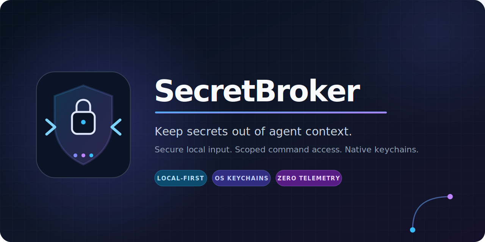

<p align="center">
  
</p>

<p align="center">
  <a href="https://github.com/HamedMP/secretbroker/actions/workflows/ci.yml"></a>
  <a href="https://crates.io/crates/secretbroker"></a>
  <a href="https://www.npmjs.com/package/secretbroker"></a>
  <a href="https://skills.sh/HamedMP/secretbroker/secretbroker"></a>
  <a href="LICENSE"></a>
  
  
</p>

<p align="center"><strong>Secure local input. Scoped command access. Native keychains.</strong></p>

SecretBroker gives local commands access to explicitly named secrets without asking users to paste secret values into an AI conversation.

It combines:

- a native Rust CLI;
- masked terminal collection;
- a one-time localhost browser form;
- fulfillment from another terminal;
- OS credential-store persistence;
- exact-value output redaction;
- a portable Agent Skill for Pi, Claude Code, and Codex.

> SecretBroker is pre-release software. Do not use it with production credentials until the threat model and platform integration have been independently reviewed.

## Why

Coding agents often need credentials for commands such as `vercel`, `gcloud`, `aws`, or `sentry-cli`. Pasting those values into chat places them in model context and usually in a session transcript. SecretBroker moves collection outside the conversation and injects values only into the selected child process.

## Build

Rust 1.88 or newer is required.

```sh
cargo build
cargo test
```

## Basic workflow

Ask for one or more values through a secure local UI:

```sh
secretbroker request \
  --scope project \
  --var VERCEL_TOKEN="Vercel deployment token" \
  --web
```

Or use masked terminal input:

```sh
secretbroker request --scope project --var VERCEL_TOKEN --terminal
```

For another terminal:

```sh
secretbroker request \
  --scope project \
  --var VERCEL_TOKEN \
  --another-terminal \
  --wait
```

Run a command with only the named value:

```sh
secretbroker run \
  --scope project \
  --with VERCEL_TOKEN \
  -- vercel deploy
```

Inspect metadata without retrieving values:

```sh
secretbroker status --scope project --json
```

SecretBroker intentionally has no `get`, `show`, or `export` command.

## Install the Agent Skill

SecretBroker is listed on [skills.sh](https://skills.sh/HamedMP/secretbroker/secretbroker). Install the skill globally for your agent with one command:

### Pi

```sh
npx -y skills@1.5.19 add HamedMP/secretbroker --skill secretbroker --agent pi --global --yes
```

### Claude Code

```sh
npx -y skills@1.5.19 add HamedMP/secretbroker --skill secretbroker --agent claude-code --global --yes
```

### Codex

```sh
npx -y skills@1.5.19 add HamedMP/secretbroker --skill secretbroker --agent codex --global --yes
```

Remove `--global` for a project-local installation. The skill tells agents never to request values in chat and to use the explicit request/run workflow.

If the SecretBroker CLI is already installed, its built-in installer can configure every supported agent at once:

```sh
secretbroker init --agent all --global
```

### Native plugin installation

The repository is also packaged as native Claude Code and Codex plugins for desktop discovery, namespaced invocation, and updates.

Claude Code:

```sh
claude plugin marketplace add HamedMP/secretbroker
claude plugin install secretbroker@secretbroker --scope user
```

Codex and the ChatGPT desktop app:

```sh
codex plugin marketplace add HamedMP/secretbroker --ref main
codex plugin add secretbroker@secretbroker
```

After installation, restart the agent if the skill does not appear. Review the skill before use because Agent Skills operate with the agent's permissions.

## `npx` distribution

The npm launcher lives in [`packages/npm`](packages/npm). Public releases will bundle signed platform binaries so this works without a Rust toolchain:

```sh
npx -y secretbroker@0.1.0 request --scope project --var VERCEL_TOKEN --web
```

Always pin an exact reviewed version when downloading credential-handling software.

## Security boundary

SecretBroker reduces accidental disclosure. It is not an adversarial sandbox. A process that receives a secret can deliberately print, transform, or transmit it. Exact output redaction cannot catch encoded or transformed values.

Use short-lived, least-privilege credentials and invoke the intended executable directly. Read the full specification and threat model in [`specs/001-secretbroker-init/spec.md`](specs/001-secretbroker-init/spec.md).

## Development status

The active implementation plan and task list are under [`specs/001-secretbroker-init`](specs/001-secretbroker-init/). Release operations are documented in [`docs/releasing.md`](docs/releasing.md). The security-preserving design for a future Codex and ChatGPT desktop control widget is in [`docs/codex-desktop-plugin.md`](docs/codex-desktop-plugin.md).

## License

Licensed under the MIT License.
